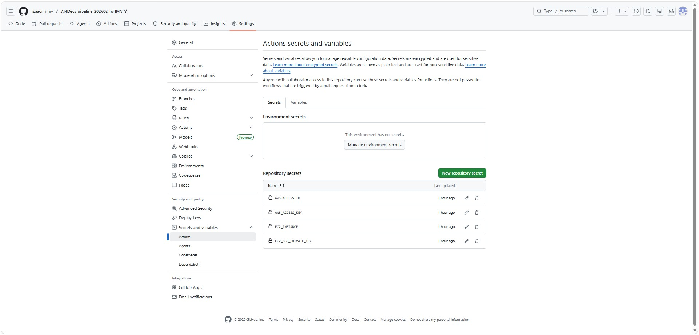
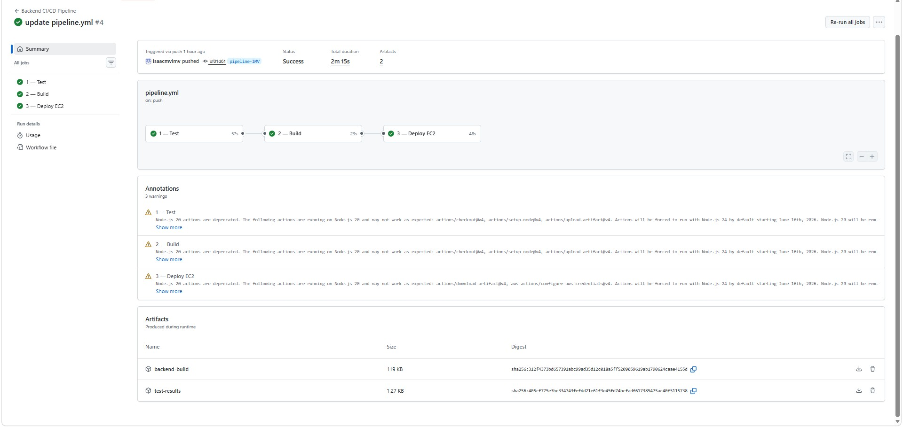
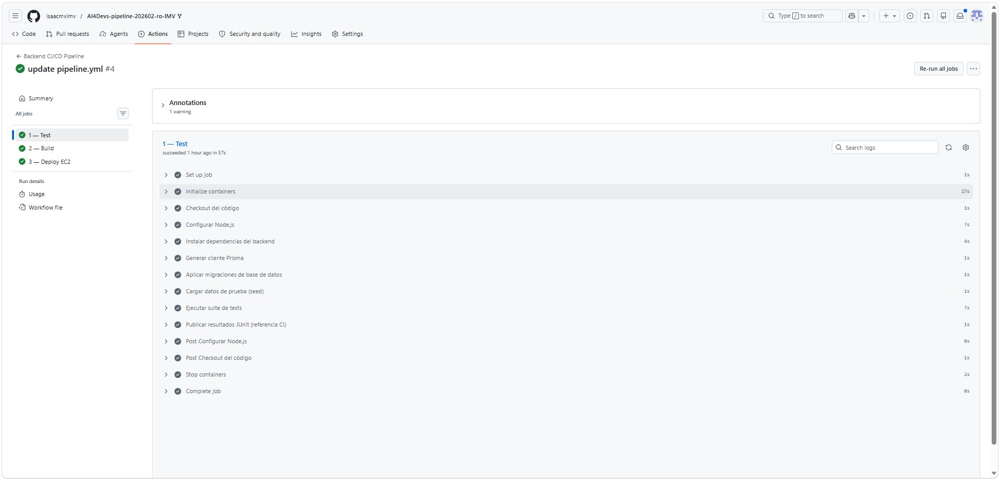
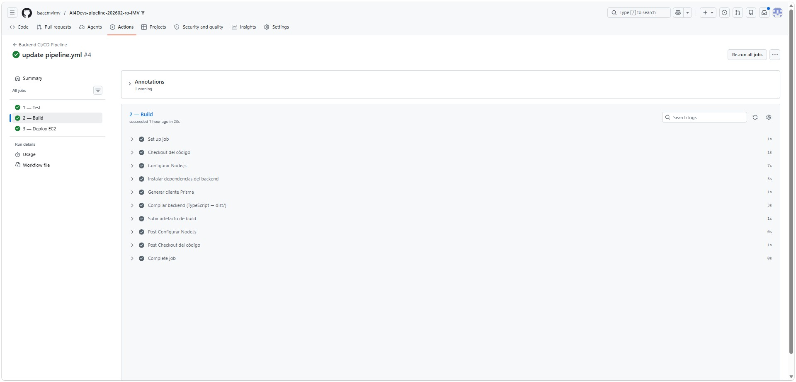
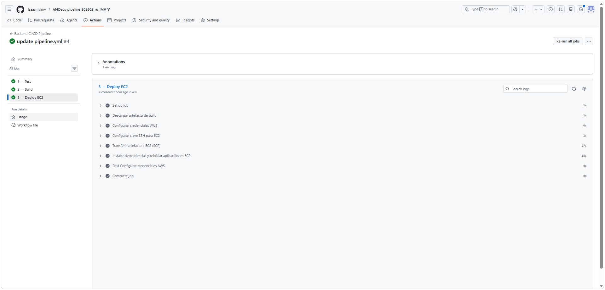

# Índice de prompts de Usuario

Listado ordenado de los prompts enviados por el usuario durante el desarrollo del proyecto. Solo se incluye el texto del **Usuario**; las respuestas de Cursor están en los ficheros de detalle enlazados.

---

## 1. Suite de tests para backend

**Detalle completo:** [01_prompts_suite_de_tests_para_backend.md](./01_prompts_suite_de_tests_para_backend.md)

### 1.1 Creación y ejecución de la suite de tests

> Eres un experto QA y necesito que crees una suite de tests capaz de probar el correcto funcionamiento del backend de este proyecto de forma autónoma.
> Una vez creados, quiero que los ejecutes y generes un report de la ejecución y el estado de cada uno de los tests.
> por último indícame con que comando lso puedo ejecutar yo manualmente.

### 1.2 Documentación en README

> Documenta estos comandos en @README.md

---

## 2. Pipeline CI/CD con GitHub Actions

**Detalle completo:** [02_prompts_github_actions_ci_cd_pipeline.md](./02_prompts_github_actions_ci_cd_pipeline.md)

### Secretos de GitHub Actions



### 2.1 Configuración del workflow CI/CD

> En GitHub hay definidas estos GitHub Secrets que permiten conectarse a una isntancia EC2 de AWS:
> AWS_ACCESS_ID
> AWS_ACCESS_KEY
> EC2_INSTANCE
> EC2_SSH_PRIVATE_KEY
>
> Ahora vas a configurar el workflow de GitHub Actions en el archivo .github/workflows/pipeline.yml y servirá para implementar el pipeline CI/CD con estos pasos:
>
> 1 - Test: Comprueba que están instaladas las dependencias y ejecuta la suite de tests del backend. Sólo continúa con el siguiente paso si todos los tests pasan correctamente sin errores.
> 2 - Build: Genera el artefacto de build del backend. Usa `actions/upload-artifact`.
> 3 - Deploy a EC2: Si el build anterior se ha generado correctamente, descarga el artefacto generado y lo despliegas en la instancia EC2 de AWS mediante SSH usando los secretos de GitHub Actions que hay configurados.
>
> Este pipeline se debe disparar sólo cuando se hac eun "push a una rama con un Pull Request abierto".
>
> Documenta el fichero YAML y cualquier detalle relevante de la implementación.

### 2.2 Ajuste de región AWS

> Región eu-north-1.

### 2.3 Ajuste de usuario SSH en EC2

> El usuario es ubuntu

### 2.4 Prueba local del pipeline

> Quiero que pruebes en local si el pipeline funciona.

### Resultado del pipeline en GitHub Actions



#### Job 1 — Test



#### Job 2 — Build



#### Job 3 — Deploy



---

## 3. Configuración y despliegue en AWS (EC2)

**Detalle completo:** [03_setup_aws.md](./03_setup_aws.md)

### 3.1 Diagnóstico de errores en el deploy

> Tengo errores el el pipeline de Git Actions al hacer el Deploy en EC2.
>
> ¿Qué debo revisar?

### 3.2 Diagnóstico de dependencias faltantes en EC2

> Me está dando esto la ejecución de los ocmandos:
>
> ```
> ubuntu@ip-172-31-39-99:~~/lti-backend$ node -v
> Command 'node' not found, but can be installed with:
> sudo apt install nodejs
> ubuntu@ip-172-31-39-99:~~/lti-backend$ sudo apt install nodejs
> Error: Unable to locate package nodejs
> ...
> ubuntu@ip-172-31-39-99:~~/lti-backend$ pm2 -v
> Command 'pm2' not found, did you mean:
> ...
> ubuntu@ip-172-31-39-99:~~/lti-backend$ cat /home/ubuntu/lti-backend/.env
> DB_USER=LTIdbUser
> ...
> ubuntu@ip-172-31-39-99:~~/lti-backend$ sudo systemctl status postgresql
> Unit postgresql.service could not be found.
> ...
> ubuntu@ip-172-31-39-99:~~/lti-backend$ docker ps
> Command 'docker' not found, but can be installed with:
> ...
> ```

### 3.3 Creación de base de datos sin sesión interactiva de psql

> Dime como ejecutar por línea de comandos el punto 5 sin depender del fichero psql externo
